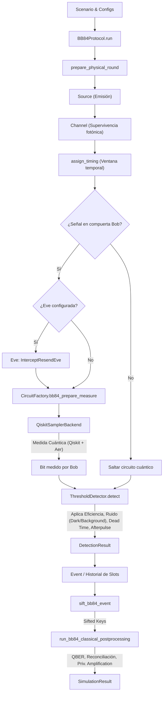

# Documentación de `qiskit-qkd`

`qiskit-qkd` es un paquete de Python orientado a la simulación de protocolos de **Distribución de Claves Cuánticas (QKD)**. Su diseño sitúa a Qiskit en el centro del procesamiento cuántico (circuitos, puertas y medidas), mientras que implementa de forma clásica y externa modelos educativos de imperfecciones físicas, temporales, espionajes y post-procesamientos clásicos.

Esta documentación detalla qué hace el repositorio, su filosofía de diseño, cómo opera bajo el capó, las fórmulas y modelos físicos que utiliza, y la estructura de su código.

---

## 1. Filosofía de Diseño: "Qiskit-first, no Qiskit-only"

Una de las decisiones arquitectónicas más importantes de `qiskit-qkd` es la delimitación clara entre lo que debe simularse mediante circuitos cuánticos y lo que debe simularse mediante modelos probabilísticos clásicos (capa de eventos):

*   **¿Qué hace Qiskit?** Qiskit es responsable únicamente del procesamiento y manipulación del estado cuántico. Se crean objetos `QuantumCircuit` para codificar los bits en bases (como la base computacional $Z$ o la base de Hadamard $X$), aplicar cambios de base de medida en Bob, realizar rotaciones coherentes de polarización (puertas `ry` y `rz`) y ejecutar las simulaciones de circuitos usando primitivas de Qiskit (como `StatevectorSampler` o `SamplerV2` de Aer).
*   **¿Qué se simula fuera de Qiskit (Capa de Eventos)?** Los efectos clásicos y fotónicos, tales como la pérdida de fotones por atenuación en fibra, el número de fotones supervivientes, la pérdida dependiente de polarización (PDL), el ensanchamiento temporal por PMD y dispersión cromática, el crosstalk Raman, la eficiencia del detector, las cuentas oscuras (dark counts), la luz de fondo (background clicks), el tiempo muerto del detector, los post-pulsos (afterpulsing), el espionaje clásico (intercept-resend) y los errores de sincronización temporal (jitter, clock offset/drift).
    *   *¿Por qué?* En un simulador puramente cuántico, la pérdida por fibra a menudo se modela usando canales de relajación de amplitud (`amplitude_damping`). Sin embargo, en QKD físico, si un fotón se pierde en el canal de fibra, simplemente **no llega al detector** (no hay evento de click); no decae a un estado $|0\rangle$ que luego es medido. Al manejar las pérdidas y los tiempos muertos en la capa de eventos clásicos, el simulador ejecuta circuitos cuánticos únicamente para los pulsos que realmente son emitidos, conservan al menos un fotón tras el canal y quedan asignados a una compuerta temporal válida de Bob, logrando una simulación mucho más eficiente y físicamente honesta.
*   **Honestidad del Modelo**: Los protocolos (como el sifting y la reconciliación clásica) separan la información pública de Alice y Bob de los diagnósticos internos del simulador (por ejemplo, el origen de un click o la acción de Eve). Hay una excepción pedagógica explícita: con `qber_sample_fraction=0`, el QBER clásico se calcula sobre toda la clave cribada como diagnóstico interno, no como una estimación obtenible mediante anuncios públicos.

---

## 2. Fases de Desarrollo

El repositorio está estructurado en base a fases incrementales de madurez:
1.  **Fase 3**: Introducción del esquema de configuración/dominio con validación de tipos y rangos, simulador de BB84 ideal respaldado por circuitos de Qiskit, atenuación en fibra, eficiencia del detector, cuentas oscuras y políticas de resolución de doble click.
2.  **Fase 3.5 (Timing y Compuertas de Bob)**: Introducción de sincronización explícita temporal. Los slots de tiempo no son contadores de fotones detectados, sino slots temporales concretos de Alice ($n$). Se añade jitter gaussiano de llegada, desalineación fija de reloj (offset), deriva térmica de reloj (drift), tiempo muerto del detector y probabilidad de post-pulso.
3.  **Fase 3.6 (Post-procesamiento Clásico)**: Capa pedagógica de reconciliación clásica posterior al sifting. Incluye muestreo reproducible de QBER, descarte por encima de umbral, reconciliación por bloques de paridad (protocolo pedagógico de corrección), cálculo de fuga de información de corrección de errores (`leak_ec`) y amplificación de privacidad basada en hashes deterministas.
4.  **Fase 4 (Ruido de Aer y Transpilación)**: Integración con Qiskit Aer `NoiseModel` para modelar errores cuánticos de estado (canal despolarizante y dephasing) y de lectura cuántica (readout error). Se introduce la opción de simular transpilación controlada a través de pass managers de Qiskit.
5.  **Fase 4.1 (Condiciones de Comunicación Dinámicas)**: Capa de perfiles temporales paramétricos que permite variar lentamente las condiciones del canal (ej. aumentar la luz de fondo de manera exponencial o cambiar el error de preparación) a lo largo del tiempo para caracterizaciones temporales.
6.  **Fase 5 (Adversario / Espionaje)**: Introducción de modelos explícitos de espionaje en el canal cuántico, implementando el ataque pedagógico de interceptación y reenvío (`InterceptResendEve`).
7.  **Fase 6 (Estados Señuelo / Decoy States)**: Implementación de fuentes de estados señuelo coherentemente atenuados con muestreo de número de fotones mediante distribución de Poisson, supervivencia binomial de fotones en fibra y estadísticas por intensidad.
8.  **Fase 6.1 (Imperfecciones Avanzadas de Fibra)**: Añade modelos de primer orden para PMD, dispersión cromática, pérdida dependiente de polarización y crosstalk Raman. Estos efectos se mantienen en la capa de eventos y caracterización: PMD/CD modifican el jitter efectivo de llegada, PDL modifica la transmitancia según el estado BB84 preparado y Raman suma una tasa de fondo óptico al detector.
9.  **Fase 6.2 (Diagnóstico Decoy Asintótico y PNS)**: Añade estimación asintótica vacuum+weak para cotar `Y1`, `Q1` y `e1`, calcula una tasa decoy diagnóstica y modela un ataque de photon-number splitting (`PhotonNumberSplittingEve`) sobre pulsos multifotón.
10. **Fase 7 (E91 y CHSH)**: Añade protocolo E91 basado en pares Bell, medidas angulares de Alice/Bob, coincidencias, QBER de clave, diagnóstico CHSH (`S`) y filas planas para graficar correlaciones.
11. **Fase 8 (Familias de Canales Ópticos)**: Añade canales no-fibra para QKD en espacio profundo, espacio libre/atmosférico/satélite y medio subacuático. Estos canales modelan pérdidas geométricas, extinción atmosférica, scintillation, jitter de apuntamiento, extinción Beer-Lambert y ensanchamiento temporal por scattering, manteniendo el ruido cuántico de estado en la capa Qiskit/Aer.
12. **Fase 9 (Analítica Visual)**: Añade analítica visual opcional con Matplotlib sobre las filas planas de análisis: barridos de métricas, resúmenes de distancia BB84, comparación de canales, diagnósticos decoy, correlaciones E91/CHSH, compromisos de Eve y conteos de timing, con export SVG/PNG listo para publicación. Matplotlib es una dependencia opcional (extra `plot`) que solo se importa al llamar a una función de gráficas, de modo que el núcleo de simulación no depende de ella.

---

## 3. Arquitectura y Flujo de Datos

El flujo completo de una simulación sigue el siguiente camino lógico:

### Detalle del Flujo de Ejecución:
1.  **Configuración**: Se define un `Scenario` que contiene los objetos de configuración de la fuente (`SourceConfig`), el canal (`ChannelConfig`), el detector (`DetectorConfig`), el timing (`TimingConfig`), el post-procesamiento (`PostProcessingConfig`), el espía opcional (`EveConfig`) y los perfiles dinámicos (`DynamicConfig`).
2.  **Resolución de Parámetros**: Si se realiza un barrido temporal, el `ParameterResolver` evalúa el tiempo $t$ y genera un `Scenario` estático efectivo sustituyendo los valores dinámicos.
3.  **Loop de Pulsos**: Para cada pulso de Alice (definido por `pulses` en el `Scenario`):
    *   La fuente decide si emite y cuántos fotones genera (fotón único o Poisson).
    *   El canal físico evalúa cuántos fotones sobreviven al enlace (`surviving_photon_number`). Para PDL, la transmitancia efectiva depende del bit y base preparados por Alice. Para canales con fading (`free_space` o `underwater`), se muestrea primero una transmitancia instantánea por pulso (`sample_transmittance(rng)`) y todos los fotones de ese pulso usan esa misma probabilidad. El booleano `transmitted` se mantiene como resumen: es verdadero cuando al menos un fotón sobrevivió.
    *   El módulo de `timing` calcula cuándo llega la señal superviviente y determina si cae dentro de la ventana de detección (compuerta o gate de Bob). PMD, dispersión cromática y scattering subacuático se incorporan como ensanchamiento temporal adicional sobre el jitter gaussiano. Si cae dentro, se le asigna un slot de Bob.
4.  **Capa de Adversario**: Si Eve está activa en un pulso con señal superviviente y asignada a compuerta, el modelo `InterceptResendEve` mide el estado BB84 en una base aleatoria y reenvía su resultado a Bob. El modelo `PhotonNumberSplittingEve` usa el número de fotones de la fuente para dividir pulsos multifotón sin introducir QBER y, opcionalmente, bloquear fotones únicos. No modela ataques coherentes o colectivos.
5.  **Ejecución Cuántica en Batch**: Para todos los pulsos donde existe una oportunidad de señal asignada a una compuerta activa en Bob, se construye un circuito BB84. Es un circuito por oportunidad de señal de umbral, no uno por fotón individual. En el camino ideal sin ruido Aer, sin transpilación y sin sampler externo, el `QiskitSamplerBackend` obtiene las probabilidades finales del `Statevector` de Qiskit y las muestrea con su propio RNG reproducible; así las rotaciones parciales (`ry`/`rz`) producen estadística física aunque haya un solo shot por ronda. Cuando hay ruido Aer, transpilación o sampler externo, los circuitos se ejecutan mediante la primitiva correspondiente y se procesan sus histogramas.
6.  **Simulación del Detector**: El `ThresholdDetector` de Bob procesa cada slot de tiempo:
    *   Verifica si el detector estaba inactivo debido al **tiempo muerto** (`dead_time_s`) de un click anterior.
    *   Si está disponible, aplica la **eficiencia del detector** sobre los fotones cuánticos supervivientes.
    *   Modela la aparición de **cuentas oscuras**, **luz de fondo** (background clicks) y **crosstalk Raman** probabilísticos en la compuerta.
    *   Resuelve coincidencias (señal + ruido) según la **política de doble click** (`double_click_policy`).
    *   Modela **post-pulsos** (afterpulses) condicionados a detecciones clásicas previas.
7.  **Sifting (Criba)**: Alice y Bob comparan públicamente sus bases de preparación y medición para los slots donde Bob registró detección. Se descartan aquellos slots con bases cruzadas.
8.  **Post-procesamiento Clásico**:
    *   Se revela una fracción de la clave cribada para estimar la tasa de error de bit cuántico (**QBER**).
    *   Si el QBER estimado supera el umbral límite, la etapa clásica se detiene antes de la reconciliación. Esta decisión no es idéntica al campo agregado legacy `metrics.abort`.
    *   Si es aceptable, se corrige la clave de Bob mediante un protocolo pedagógico de paridad por bloques.
    *   Se aplica una amplificación de privacidad determinista pedagógica basada en el QBER y la paridad revelada, generando un digest reproducible para pruebas; no es material de clave operativo.
9.  **Métricas y Resultados**: Se calculan ganancia, QBER, tasa de clave cribada y una estimación asintótica pedagógica de tasa de clave. `SimulationResult.assessment` indica si el QBER está definido, si hay datos suficientes, el estado de verificación y clave, y el alcance científico de la estimación.

Los eventos (`Event`) almacenan tanto `photon_number` como `surviving_photon_number`. Las estadísticas decoy agregadas en `SimulationResult.decoy` incluyen también `surviving_photons`, lo que permite auditar que el canal, el detector y las intensidades se comportan de forma coherente sin depender de logs completos. Cuando hay intensidades señal, decoy débil y vacío, `SimulationResult.decoy["security"]` añade la estimación asintótica vacuum+weak si `PostProcessingConfig.decoy_security_estimation_enabled=True`; `security` es aquí una clave legacy para un diagnóstico, no una prueba formal.

Para análisis y gráficas, `decoy_rows_from_result(result)` convierte el resumen decoy anidado en filas planas con `row_type="intensity"` o `row_type="security"`, aptas para CSV, Pandas o visualización directa.

E91 se implementa como un protocolo separado (`E91Protocol`), no como una variante de BB84. Qiskit prepara y mide el par Bell, mientras la capa de eventos conserva pérdidas del brazo de Bob, timing, detectores y ruido óptico de Bob. Como la fuente se modela co-localizada con Alice, el detector de Alice mantiene cuentas oscuras, tiempo muerto y post-pulsos, pero no recibe el fondo de canal ni el crosstalk Raman acumulado en la fibra de Bob. `SimulationResult.bell` almacena las correlaciones por par de ajustes y `bell_rows_from_result(result)` las convierte en filas listas para gráficas.

### Lectura científica de resultados y procedencia

El campo numérico legacy `metrics.qber` conserva el valor `0.0` cuando no hay
bits cribados para no romper serializaciones anteriores. Ese cero no es una
observación: `assessment.qber_defined=False`, `qber_value=None` y
`data_status="insufficient_data"` son la interpretación autoritativa. Asimismo,
`metrics.abort`, la decisión del umbral sobre la muestra clásica,
`verification_status`, `key_status` y `rate_estimate_status` responden preguntas
distintas. Ninguno de ellos, por separado o combinado, demuestra seguridad
formal.

Las tasas llamadas históricamente `secret_key_rate_bps` son comparadores
pedagógicos asintóticos. No incluyen análisis finite-key, parámetros de fallo,
autenticación del canal clásico, pruebas componibles, efectos laterales ni una
certificación del hardware real. `assessment.security_scope` las etiqueta como
`pedagogical_asymptotic_diagnostic`; `finite_key` y `composable` son falsos.

La procedencia conserva la configuración solicitada y su digest, la semilla,
el snapshot `provenance.effective_model` realmente usado y los metadatos del
backend/primitive, Qiskit y Aer. Un mismo digest solicitado no basta para
reproducir una ejecución si cambian el modelo efectivo, las versiones o la ruta
de backend. En barridos temporales cada punto es un escenario estático resuelto;
las filas distinguen `requested_scenario_digest` del
`effective_scenario_digest`. Un barrido no representa por sí mismo una
trayectoria física con memoria entre puntos.

El sobre actual de `SimulationResult` es schema v2 y exige un `assessment`
no nulo coherente con escenario, métricas y diagnósticos. El lector conserva
compatibilidad de entrada con schema v1, deriva la evaluación y registra el
origen en `provenance.archive_load`; `to_legacy_dict()` y
`to_legacy_json()` generan una exportación v1 explícita y necesariamente
lossy. Cargar un archivo histórico no sustituye su versión productora ni
inventa un `effective_model` con el runtime lector.

La procedencia actual no incluye un digest del checkout/commit ni la versión
del runtime de Python; para reproducción a largo plazo deben archivarse aparte
la revisión de control de versiones y el entorno bloqueado.

---

## 4. Modelos Físicos y Fórmulas Clave

### A. Canal de Fibra Óptica y Degradación de Canal (`FiberChannel`)

El modelado físico de la fibra óptica en `qiskit-qkd` se divide en efectos fotónicos clásicos (pérdidas y atenuación en la capa de eventos) y efectos cuánticos de degradación del estado de polarización (birefringencia y ruido cuántico en el circuito).

#### 1. Pérdidas y Atenuación Fotónica (Capa de Eventos)
La pérdida de atenuación en decibelios a lo largo del canal depende del coeficiente de atenuación lineal de la fibra $\alpha_{\text{db\_km}}$ (ej. $0.2\text{ dB/km}$ a $1550\text{ nm}$), la distancia $L$ en kilómetros y las pérdidas fijas de acoplamiento $L_{\text{fixed}}$:
$$\text{loss\_db} = \alpha_{\text{db\_km}} \times L + L_{\text{fixed}}$$

La transmitancia de la fibra $\eta_{\text{channel}}$ (probabilidad de que un fotón irradia o sobreviva a la absorción o scattering en la fibra) es:
$$\eta_{\text{channel}} = 10^{-\frac{\text{loss\_db}}{10}}$$

Para pulsos coherentes atenuados (WCS) con $n$ fotones iniciales, la probabilidad de supervivencia fotónica no es un todo/nada, sino que el número de fotones supervivientes $K_{\text{survives}}$ sigue una distribución binomial:
$$K_{\text{survives}} \sim \text{Binomial}(n, \eta_{\text{channel}})$$

#### 2. Pérdida Dependiente de Polarización / PDL (Capa de Eventos)
La PDL se modela como una pérdida adicional dependiente del estado BB84 preparado. Se define un eje preferente mediante `pdl_axis_basis` y `pdl_axis_bit`, y una diferencia de pérdida `polarization_dependent_loss_db`. El modo favorecido conserva la transmitancia base; el modo ortogonal recibe el factor:
$$f_{\text{pdl,min}} = 10^{-\frac{\text{PDL}_{\text{db}}}{10}}$$

Para estados preparados en la base conjugada se usa la media de los dos automodos:
$$f_{\text{pdl,conj}} = \frac{1 + f_{\text{pdl,min}}}{2}$$

La transmitancia usada para muestrear cada fotón es:
$$\eta_{\text{state}} = \eta_{\text{channel}} \cdot f_{\text{pdl}}(b, B)$$

Este modelo no amplifica nunca la señal: solo reduce o mantiene la transmitancia de fibra. Es deliberadamente simple y trazable, adecuado para estudiar sesgos de ganancia por estado sin introducir una matriz de Jones completa.

#### 3. PMD, Dispersión Cromática y Ensanchamiento Temporal (Capa de Eventos)
La dispersión por modo de polarización (PMD) y la dispersión cromática no se simulan como puertas cuánticas. En este simulador se modelan como ensanchamiento temporal que aumenta la probabilidad de que una señal llegue fuera de la compuerta de Bob.

Para PMD:
$$\sigma_{\text{PMD}} = D_{\text{PMD}} \sqrt{L}$$
donde `pmd_coefficient_ps_sqrt_km` está en ps/$\sqrt{\text{km}}$ y $L$ en km.

Para dispersión cromática:
$$\sigma_{\text{CD}} = |D_{\lambda}| L \Delta\lambda$$
donde `chromatic_dispersion_ps_nm_km` está en ps/(nm km) y `source_spectral_width_nm` representa la anchura espectral usada por el modelo.

El jitter efectivo de llegada se combina en cuadratura:
$$\sigma_{\text{eff}} = \sqrt{\sigma_{\text{jitter}}^2 + \sigma_{\text{PMD}}^2 + \sigma_{\text{CD}}^2}$$

`assign_timing` usa este $\sigma_{\text{eff}}$ para muestrear la llegada. Por tanto, el efecto observable es tangible: más eventos `early`/`late`, más `timing_discards` y menor ganancia cuando la compuerta es estrecha.

#### 4. Crosstalk Raman de Canales Clásicos (Capa de Eventos)
El crosstalk Raman se modela como una tasa adicional de fotones de fondo en la banda de Bob, producida por canales clásicos multiplexados en la misma fibra:
$$R_{\text{Raman}} = C_{\text{Raman}} P_{\text{clásica}} L \cdot 10^{-\frac{I_{\text{filter}}}{10}}$$

En el código:
* `classical_channel_power_mw` es la potencia clásica en mW.
* `raman_coefficient_hz_mw_km` convierte potencia y distancia en tasa de cuentas.
* `raman_filter_isolation_db` representa el aislamiento del filtrado óptico.

La tasa efectiva de fondo que recibe el detector es:
$$R_{\text{background,eff}} = R_{\text{background}} + R_{\text{Raman}}$$

El detector convierte esa tasa en probabilidad por compuerta con la misma ley de Poisson que la luz de fondo óptica. En eventos aparece como `detection_origin="background"`, porque para Bob es indistinguible de otro fondo óptico no señal.

#### 5. Birefringencia y Rotaciones de Polarización Coherentes (Capa Cuántica)
Las tensiones mecánicas y las asimetrías geométricas de la fibra real introducen birefringencia, rotando el estado de polarización del fotón de forma determinista. Esto se simula aplicando rotaciones unitarias sobre la esfera de Bloch alrededor de los ejes Y y Z antes de la medida de Bob:
$$R_y(\theta_y) = e^{-i \frac{\theta_y}{2} \sigma_y} = \begin{pmatrix} \cos\left(\frac{\theta_y}{2}\right) & -\sin\left(\frac{\theta_y}{2}\right) \\ \sin\left(\frac{\theta_y}{2}\right) & \cos\left(\frac{\theta_y}{2}\right) \end{pmatrix}$$
$$R_z(\theta_z) = e^{-i \frac{\theta_z}{2} \sigma_z} = \begin{pmatrix} e^{-i \frac{\theta_z}{2}} & 0 \\ 0 & e^{i \frac{\theta_z}{2}} \end{pmatrix}$$
Donde $\theta_y$ y $\theta_z$ representan los desfases coherentes introducidos por la fibra (`polarization_rotation_y_rad` y `polarization_rotation_z_rad`).

#### 6. Ruido Despolarizante (Capa Cuántica - Aer)
Debido al acoplamiento del canal con el entorno, la polarización del fotón sufre ruido de despolarización incoherente. Se modela en Qiskit Aer como un canal cuántico que con probabilidad $p_{\text{depol}}$ transforma el estado cuántico de densidad $\rho$ en una mezcla estadística simétrica de Pauli:
$$\mathcal{E}_{\text{depol}}(\rho) = (1 - p_{\text{depol}})\rho + \frac{p_{\text{depol}}}{3}(\sigma_x \rho \sigma_x + \sigma_y \rho \sigma_y + \sigma_z \rho \sigma_z)$$
Para un qubit, esto es físicamente equivalente a sustituir el estado original por el estado máximamente mezclado $\frac{1}{2}I$ (ruido blanco cuántico) con probabilidad $\frac{4}{3}p_{\text{depol}}$.

#### 7. Amortiguamiento de Fase / Dephasing (Capa Cuántica - Aer)
El ruido térmico y las fluctuaciones de fase en la fibra destruyen la coherencia cuántica sin pérdida de energía. Se modela como un canal de amortiguamiento de fase (phase damping) con probabilidad $p_{\text{phase}}$, atenuando los elementos fuera de la diagonal de la matriz de densidad $\rho$:
$$\mathcal{E}_{\text{phase}}(\rho) = \begin{pmatrix} \rho_{00} & \sqrt{1-p_{\text{phase}}}\rho_{01} \\ \sqrt{1-p_{\text{phase}}}\rho_{10} & \rho_{11} \end{pmatrix}$$

### A.2 Canales Ópticos No-Fibra (`SpaceChannel`, `FreeSpaceChannel`, `UnderwaterChannel`)

La Fase 8 extiende la capa de eventos con tres medios ópticos adicionales. La decisión de diseño es la misma que en fibra: las pérdidas de fotones se modelan como supervivencia/no-click, mientras que la degradación cuántica de estado sigue configurándose explícitamente mediante rotaciones coherentes o ruido Aer.

#### 1. Canal de Espacio Profundo / Vacío (`space`)
El vacío no introduce absorción atmosférica ni dispersión material en este modelo de primer orden. La pérdida dominante se debe a la divergencia del haz y al acoplamiento entre la apertura emisora y receptora. Si no se configura `beam_divergence_rad`, se usa la estimación de difracción:
$$\theta = 2.44\frac{\lambda}{D_t}$$

El diámetro aproximado del haz en Bob es:
$$D_{\text{beam}}(L)=D_t+\theta L$$

Y la transmitancia geométrica queda:
$$\eta_{\text{geom}}=\min\left(1,\left(\frac{D_r}{D_{\text{beam}}(L)}\right)^2\right)$$

La transmitancia final incluye pérdidas ópticas fijas:
$$\eta_{\text{space}}=\eta_{\text{geom}}\cdot 10^{-\frac{L_{\text{fixed}}}{10}}$$

#### 2. Canal de Espacio Libre / Satélite (`free_space`)
El canal atmosférico añade extinción por absorción y scattering molecular/aerosoles:
$$\eta_{\text{base}}=\eta_{\text{geom}}\cdot 10^{-\frac{L_{\text{fixed}}+\beta_{\text{ext}}L}{10}}$$

Para hacer tangibles turbulencia y apuntamiento sin introducir un solver óptico completo, el simulador separa dos valores:
* `transmittance()` devuelve la transmitancia base estable, útil para caracterización y gráficas.
* `sample_transmittance(rng)` muestrea la transmitancia instantánea de un pulso.

La scintillation se modela con una log-normal de media uno:
$$f_{\text{scint}}\sim\text{LogNormal}\left(-\frac{\sigma^2}{2},\sigma\right)$$

El error de apuntamiento se modela como un desplazamiento radial Rayleigh en el plano receptor:
$$r_{\text{point}}\sim\text{Rayleigh}(\sigma_{\theta}L)$$
$$f_{\text{point}}=\exp\left(-2\left(\frac{r_{\text{point}}}{w(L)}\right)^2\right)$$

La transmitancia instantánea es:
$$\eta_{\text{instant}}=\text{clip}_{[0,1]}(\eta_{\text{base}}f_{\text{scint}}f_{\text{point}})$$

#### 3. Canal Subacuático (`underwater`)
En agua se usa la ley de Beer-Lambert con coeficiente de extinción en metros inversos, más natural para enlaces subacuáticos de decenas o cientos de metros:
$$\eta_{\text{water}}=\eta_{\text{geom}}\cdot e^{-cL_m}\cdot 10^{-\frac{L_{\text{fixed}}}{10}}$$

El canal subacuático puede usar la misma scintillation y el mismo jitter de apuntamiento que `free_space`. Además, el scattering múltiple puede ensanchar temporalmente el pulso:
$$\sigma_{\text{scattering}}=\text{underwater\_scattering\_broadening\_ns\_per\_m}\cdot L_m\cdot10^{-9}$$

El ensanchamiento total usado por el timing combina PMD, dispersión cromática y scattering:
$$\sigma_{\text{broadening}}=\sqrt{\sigma_{\text{PMD}}^2+\sigma_{\text{CD}}^2+\sigma_{\text{scattering}}^2}$$

`ChannelCharacterizer` expone columnas como `channel_kind`, `geometric_transmittance`, `effective_beam_divergence_rad`, `atmospheric_loss_db`, `scintillation_sigma`, `pointing_jitter_rad`, `underwater_extinction_m_inv` y `scattering_broadening_s`, preparadas para CSV, Pandas o gráficas.

Estos modelos no son meteorología orbital, óptica adaptativa, propagación wavefront completa ni scattering espectral resuelto por longitud de onda. Son modelos de presupuesto de enlace y timing, compactos y modificables, adecuados para comparar escenarios QKD en la memoria del TFG.

### B. Fuente de Estados Coherentes Atenuados (WCS)
El número de fotones $n$ generados en un slot por una fuente láser pulsada y atenuada con un valor medio de fotones $\mu$ sigue la distribución de Poisson:
$$P(n | \mu) = \frac{e^{-\mu} \mu^n}{n!}$$

### B.2 Estimación Decoy Vacuum+Weak (Fase 6.2)
Para una intensidad señal $\mu$, una intensidad decoy débil $\nu$ y una clase vacío, el simulador estima cotas asintóticas de BB84 decoy a partir de las ganancias observadas:
$$Q_\mu = \frac{\text{detecciones señal}}{\text{pulsos señal}}, \quad Q_\nu = \frac{\text{detecciones decoy}}{\text{pulsos decoy}}, \quad Y_0 = Q_{\text{vacuum}}$$

La cota inferior del yield de fotón único es:
$$Y_1^L = \frac{\mu}{\mu\nu-\nu^2}\left(Q_\nu e^\nu - Q_\mu e^\mu\frac{\nu^2}{\mu^2} - \frac{\mu^2-\nu^2}{\mu^2}Y_0\right)$$

La ganancia de fotón único queda:
$$Q_1^L = \mu e^{-\mu}Y_1^L$$

Y la cota superior del error de fotón único:
$$e_1^U = \frac{E_\nu Q_\nu e^\nu - \frac{1}{2}Y_0}{\nu Y_1^L}$$

Con estas cotas se calcula una tasa secreta diagnóstica:
$$R_{\text{signal}} = q_{\text{sift}}\max\left(0, Q_1^L(1-h_2(e_1^U)) - f_{\text{ec}}Q_\mu h_2(E_\mu)\right)$$

Esta tasa es asintótica y útil para comparar escenarios normales, ruidosos y bajo PNS. No es una prueba finite-key ni componible. Se puede desactivar con `decoy_security_estimation_enabled=False` o `decoy_security_method="none"` para conservar únicamente las estadísticas observadas por intensidad.

### B.3 Ataque Photon-Number Splitting / PNS
`PhotonNumberSplittingEve` modela un ataque QND idealizado sobre pulsos WCS:
* Si `photon_number >= 2`, Eve conserva un fotón y reenvía el mismo estado BB84 a Bob. No introduce QBER por sí misma, pero aprende el bit cuando la base se anuncia públicamente.
* Si `photon_number == 1`, Eve puede bloquear el pulso con `pns_block_single_photon_probability` para imitar pérdida de canal.

Las trazas se guardan como `eve_action="pns_split"` o `eve_action="pns_block_single"`, junto con tags como `eve_forwarded_photons`, `eve_photons_kept` y `eve_blocked_signal`.

### B.4 Protocolo E91 y Diagnóstico CHSH (Fase 7)
E91 utiliza una fuente de pares entrelazados. Por defecto se prepara el singlete:
$$|\psi^-\rangle = \frac{|01\rangle - |10\rangle}{\sqrt{2}}$$

Alice y Bob escogen ajustes angulares $a$ y $b$. Para el singlete ideal, la correlación esperada es:
$$E(a,b) = -\cos(a-b)$$

El simulador estima cada correlación desde coincidencias detectadas:
$$E(a,b)=\frac{N_{\text{same}}(a,b)-N_{\text{different}}(a,b)}{N_{\text{same}}(a,b)+N_{\text{different}}(a,b)}$$

Con los términos configurados en `E91Config.chsh_terms`, calcula:
$$S=\left|\sum_{a,b} c_{ab}E(a,b)\right|$$

La configuración acepta exactamente cuatro pares únicos que formen una malla
2x2 completa, con coeficientes enteros $\pm1$ cuyo producto de signos sea
$-1$. Así todos los testigos aceptados tienen cota local clásica 2; se
rechazan términos vacíos, duplicados, incompletos o patrones cuya cota sería
4. El resumen Bell conserva `classical_bound=2.0` y una decisión observada
triestado. El booleano legacy `bell_violation` proyecta el estado desconocido a
`false` y no debe usarse sin el tamaño de muestra.

Un valor observado $S>2$ cruza el umbral CHSH clásico en la muestra de coincidencias detectadas del modelo. El caso ideal se aproxima a $2\sqrt{2}$ salvo fluctuaciones Monte Carlo. La conclusión es diagnóstica y post-seleccionada, bajo una interpretación de *fair sampling*: no se calcula significación estadística ni intervalo de confianza, no se cierran los *loopholes* de detección/localidad y no se obtiene una prueba *device-independent* o finite-key. `assessment` registra el tamaño total y por término de la muestra CHSH para evitar presentar el cruce de umbral sin denominador.

La tasa secreta reportada en E91 usa el modelo `pedagogical_bb84_asymptotic_qber_fraction`: reutiliza la fracción asintótica basada en QBER de BB84 como métrica comparativa didáctica. No debe interpretarse como una cota de seguridad device-independent.

El ruido de preparación de la fuente E91 se controla con `SourceConfig.preparation_error_probability` y se implementa como un error Pauli aleatorio sobre el qubit de Bob antes del canal. Las rotaciones coherentes y el ruido Aer se aplican después del marcador de canal, igual que en BB84. Las pérdidas, no-clicks, eficiencia del detector, cuentas oscuras, fondo óptico, tiempo muerto y post-pulsos permanecen en la capa de eventos.

En E91, las coincidencias exigen compatibilidad temporal estricta: el fotón de Bob debe estar asignado al mismo slot que el intento de Alice (`assigned_slot == time_slot`). Si una política como `nearest` desplaza la señal a una ventana vecina, el evento queda trazado como diagnóstico de timing, pero no se cuenta como coincidencia válida para la correlación Bell original.

La PDL merece una frontera explícita. En BB84, la polarización preparada por Alice es un dato clásico antes del canal, por lo que la capa de eventos puede aplicar una transmitancia dependiente de estado. En E91, el fotón de Bob forma parte de un estado entrelazado y no tiene una polarización clásica definida antes de la medida. Por eso la PDL clásica de BB84 no se aplica a la supervivencia E91. Un modelo riguroso de PDL en E91 debería introducir un canal cuántico no unitario sobre el qubit de Bob, o una descripción de pérdida dependiente de polarización dentro de la simulación cuántica, con mayor coste computacional y una frontera distinta entre Qiskit y la capa de eventos.

### C. Probabilidad de Cuenta Oscura y Ruido de Fondo (`ThresholdDetector`)
La probabilidad de que ocurra una cuenta oscura en una ventana de detección (compuerta) de ancho $t_{\text{gate}}$ dada una tasa de cuentas oscuras en Hz ($R_{\text{dark}}$) es:
$$p_{\text{dark}} = 1 - e^{-R_{\text{dark}} \times t_{\text{gate}}}$$

De igual manera, para la tasa de ruido de fondo óptico externo $R_{\text{background}}$ (luz ambiental):
$$p_{\text{background}} = 1 - e^{-R_{\text{background}} \times t_{\text{gate}}}$$

Cuando hay crosstalk Raman, el detector usa la tasa efectiva:
$$p_{\text{background,eff}} = 1 - e^{-(R_{\text{background}} + R_{\text{Raman}}) \times t_{\text{gate}}}$$

### D. Eficiencia del Detector sobre Pulsos Multi-fotón
Para un pulso con $K_{\text{survives}}$ fotones incidentes, la probabilidad de click de señal en un detector de umbral (SPAD) con eficiencia $\eta_{\text{detector}}$ es:
$$p_{\text{signal\_click}} = 1 - (1 - \eta_{\text{detector}})^{K_{\text{survives}}}$$

Marginalmente, para un pulso emitido con $n$ fotones, sin cuentas oscuras, luz de fondo, descartes temporales ni tiempo muerto, el modelo implementa:
$$P(\text{signal click} | n) = 1 - (1 - \eta_{\text{channel}} \eta_{\text{detector}})^n$$

### E. Timing y Desalineación del Reloj (`TimingOutcome`)
El centro de la compuerta de Bob para el slot $n$ se calcula considerando el retardo de propagación física, el desfase inicial de reloj ($t_{\text{offset}}$) y la deriva del reloj por envejecimiento o temperatura en partes por millón ($\text{drift}_{\text{ppm}}$):
$$t_{\text{center}}(n) = t_{\text{prop}} + t_{\text{offset}} + n \times T_{\text{slot}} \times \left(1 + \text{drift}_{\text{ppm}} \times 10^{-6}\right)$$

El fotón llega al detector a:
$$t_{\text{arrival}} = n \times T_{\text{slot}} + t_{\text{prop}} + \text{jitter}$$
donde $\text{jitter} \sim \mathcal{N}(0, \sigma_{\text{eff}}^2)$. En ausencia de PMD y dispersión cromática, $\sigma_{\text{eff}} = \sigma_{\text{jitter}}$. El fotón es asignado a la compuerta de detección si:
$$t_{\text{center}}(n) - \frac{t_{\text{gate}}}{2} \le t_{\text{arrival}} \le t_{\text{center}}(n) + \frac{t_{\text{gate}}}{2}$$

### F. Perfiles Temporales Dinámicos (Easing Exponencial)
Para perfiles dinámicos de parámetros en la Fase 4.1, la interpolación exponencial entre $t_{\text{start}}$ y $t_{\text{end}}$ se define mediante:
$$u = \frac{t_{\text{time}} - t_{\text{start}}}{t_{\text{end}} - t_{\text{start}}}$$
$$\text{factor} = \frac{e^{\text{curve} \cdot u} - 1}{e^{\text{curve}} - 1}$$
$$\text{value} = v_{\text{start}} + (v_{\text{end}} - v_{\text{start}}) \cdot \text{factor}$$

### G. Fracción Secreta de Clave Asintótica (Pedagógica)
La fracción secreta se calcula a partir del QBER ($q$) y de la eficiencia de la corrección de errores ($f_{\text{ec}} \ge 1.0$) mediante la fórmula:
$$\text{secret\_fraction} = \max\left(0,\, 1 - f_{\text{ec}} \cdot h_2(q) - h_2(q)\right)$$
donde $h_2(x) = -x \log_2(x) - (1-x) \log_2(1-x)$ es la función de entropía binaria de Shannon.

---

## 5. Estructura del Código

El código fuente está distribuido dentro del directorio `src/qiskit_qkd/` de la siguiente manera:

*   [`config/`](file:///c:/Users/javi/Documents/TFG/qiskit-qkd/src/qiskit_qkd/config): Define las clases de configuración (`Scenario`, `SourceConfig`, `ChannelConfig`, etc.) y sus validaciones de rangos y valores lógicos mediante [schema.py](file:///c:/Users/javi/Documents/TFG/qiskit-qkd/src/qiskit_qkd/config/schema.py).
*   [`backends/`](file:///c:/Users/javi/Documents/TFG/qiskit-qkd/src/qiskit_qkd/backends): Contiene la integración con Qiskit. [qiskit_sampler.py](file:///c:/Users/javi/Documents/TFG/qiskit-qkd/src/qiskit_qkd/backends/qiskit_sampler.py) proporciona la clase `QiskitSamplerBackend`, que toma los lotes de medidas físicas deseadas, construye circuitos inspeccionables, muestrea `Statevector` en el camino ideal y ejecuta primitivas (`StatevectorSampler` externo o `SamplerV2` de Aer) cuando el usuario configura sampler, transpilación o ruido.
*   [`channels/`](file:///c:/Users/javi/Documents/TFG/qiskit-qkd/src/qiskit_qkd/channels): Modelos de canales físicos. [fiber.py](file:///c:/Users/javi/Documents/TFG/qiskit-qkd/src/qiskit_qkd/channels/fiber.py) implementa la atenuación exponencial, [ideal.py](file:///c:/Users/javi/Documents/TFG/qiskit-qkd/src/qiskit_qkd/channels/ideal.py) un canal sin pérdidas, [space.py](file:///c:/Users/javi/Documents/TFG/qiskit-qkd/src/qiskit_qkd/channels/space.py) los canales de espacio profundo, espacio libre y subacuáticos, [impairments.py](file:///c:/Users/javi/Documents/TFG/qiskit-qkd/src/qiskit_qkd/channels/impairments.py) las fórmulas de PMD/CD/PDL/Raman/scattering y [characterization.py](file:///c:/Users/javi/Documents/TFG/qiskit-qkd/src/qiskit_qkd/channels/characterization.py) las filas JSON de caracterización.
*   [`detectors/`](file:///c:/Users/javi/Documents/TFG/qiskit-qkd/src/qiskit_qkd/detectors): Contiene [threshold.py](file:///c:/Users/javi/Documents/TFG/qiskit-qkd/src/qiskit_qkd/detectors/threshold.py), que modela detectores de un solo umbral (SPADs) con eficiencias, ruido de fondo, y ruidos de memoria (tiempo muerto y post-pulsos).
*   [`eavesdroppers/`](file:///c:/Users/javi/Documents/TFG/qiskit-qkd/src/qiskit_qkd/eavesdroppers): Contiene [bb84.py](file:///c:/Users/javi/Documents/TFG/qiskit-qkd/src/qiskit_qkd/eavesdroppers/bb84.py) para modelar adversarios como el ataque `InterceptResendEve` y el modelo nulo `NoEve`.
*   [`temporal/`](file:///c:/Users/javi/Documents/TFG/qiskit-qkd/src/qiskit_qkd/temporal): Lógica de perfiles paramétricos para barridos temporales. Contiene [profiles.py](file:///c:/Users/javi/Documents/TFG/qiskit-qkd/src/qiskit_qkd/temporal/profiles.py) (perfiles constante, lineal y exponencial) y [resolver.py](file:///c:/Users/javi/Documents/TFG/qiskit-qkd/src/qiskit_qkd/temporal/resolver.py) para reconfigurar escenarios de forma estática en un tiempo $t$.
*   [`postprocessing/`](file:///c:/Users/javi/Documents/TFG/qiskit-qkd/src/qiskit_qkd/postprocessing): Lógica clásica del protocolo.
    *   [sifting.py](file:///c:/Users/javi/Documents/TFG/qiskit-qkd/src/qiskit_qkd/postprocessing/sifting.py): Alineación de claves y descarte de bases.
    *   [classical.py](file:///c:/Users/javi/Documents/TFG/qiskit-qkd/src/qiskit_qkd/postprocessing/classical.py): Muestreo de QBER, corrección por paridades de bloque y hashing de amplificación de privacidad.
    *   [key_rate.py](file:///c:/Users/javi/Documents/TFG/qiskit-qkd/src/qiskit_qkd/postprocessing/key_rate.py): Cálculo de entropía y tasas de clave secreta.
*   [`protocols/`](file:///c:/Users/javi/Documents/TFG/qiskit-qkd/src/qiskit_qkd/protocols): Orquestación del protocolo. [bb84.py](file:///c:/Users/javi/Documents/TFG/qiskit-qkd/src/qiskit_qkd/protocols/bb84.py) contiene el bucle principal BB84 y [e91.py](file:///c:/Users/javi/Documents/TFG/qiskit-qkd/src/qiskit_qkd/protocols/e91.py) implementa pares Bell, coincidencias y CHSH.
*   [`qiskit_integration/`](file:///c:/Users/javi/Documents/TFG/qiskit-qkd/src/qiskit_qkd/qiskit_integration): Integración cuántica fina.
    *   [circuits.py](file:///c:/Users/javi/Documents/TFG/qiskit-qkd/src/qiskit_qkd/qiskit_integration/circuits.py): Genera los circuitos cuánticos BB84.
    *   [noise.py](file:///c:/Users/javi/Documents/TFG/qiskit-qkd/src/qiskit_qkd/qiskit_integration/noise.py): Adaptador de modelos de ruido de Aer (`depolarizing`, `phase_damping` y `readout_error`).
    *   [transpilation.py](file:///c:/Users/javi/Documents/TFG/qiskit-qkd/src/qiskit_qkd/qiskit_integration/transpilation.py): Opciones de transpilación para el backend primitivo.
*   [`results/`](file:///c:/Users/javi/Documents/TFG/qiskit-qkd/src/qiskit_qkd/results): Define las clases que empaquetan las salidas del simulador ([event.py](file:///c:/Users/javi/Documents/TFG/qiskit-qkd/src/qiskit_qkd/results/event.py), [metrics.py](file:///c:/Users/javi/Documents/TFG/qiskit-qkd/src/qiskit_qkd/results/metrics.py) y [result.py](file:///c:/Users/javi/Documents/TFG/qiskit-qkd/src/qiskit_qkd/results/result.py)).
*   [`sources/`](file:///c:/Users/javi/Documents/TFG/qiskit-qkd/src/qiskit_qkd/sources): Modelos de fuentes emisoras. [single_photon.py](file:///c:/Users/javi/Documents/TFG/qiskit-qkd/src/qiskit_qkd/sources/single_photon.py) contiene `EmissionEvent`, `IdealSinglePhotonSource`, `WeakCoherentDecoySource` y `source_from_config`.
*   [`analysis/`](file:///c:/Users/javi/Documents/TFG/qiskit-qkd/src/qiskit_qkd/analysis): Utilidades para realizar barridos paramétricos, barridos de tiempo dinámicos, filas planas de decoy y filas Bell/CHSH listas para graficar.
*   [`visualization/`](file:///c:/Users/javi/Documents/TFG/qiskit-qkd/src/qiskit_qkd/visualization): Capa opcional de gráficas de la Fase 9 basada en Matplotlib. [plots.py](file:///c:/Users/javi/Documents/TFG/qiskit-qkd/src/qiskit_qkd/visualization/plots.py) define los graficadores genéricos, [recipes.py](file:///c:/Users/javi/Documents/TFG/qiskit-qkd/src/qiskit_qkd/visualization/recipes.py) las recetas de dominio (distancia BB84, comparación de canales, decoy, CHSH de E91, compromisos de Eve y timing) y [style.py](file:///c:/Users/javi/Documents/TFG/qiskit-qkd/src/qiskit_qkd/visualization/style.py) el estilo común. Solo importa Matplotlib cuando se invoca una gráfica.
*   [channel_core.py](file:///c:/Users/javi/Documents/TFG/qiskit-qkd/src/qiskit_qkd/channel_core.py): Orquesta la evaluación conjunta de fuente, canal y timing para cada pulso en cada slot temporal.
*   [timing.py](file:///c:/Users/javi/Documents/TFG/qiskit-qkd/src/qiskit_qkd/timing.py): Implementa el cálculo matemático de asignación de ventanas de llegada y desalineaciones de compuertas temporales.
*   [reproducibility.py](file:///c:/Users/javi/Documents/TFG/qiskit-qkd/src/qiskit_qkd/reproducibility.py): Garantiza que los generadores de números aleatorios (`random.Random`) se inicialicen de forma reproducible a partir de la semilla del `Scenario`.

---

## 6. Pruebas y Verificación

El repositorio cuenta con una suite de pruebas unitarias localizada en [`tests/`](file:///c:/Users/javi/Documents/TFG/qiskit-qkd/tests). Estas pruebas validan de forma continua:
*   **Ruido de Aer (`test_aer_noise.py`)**: Valida que el canal despolarizante, dephasing y errores de lectura se carguen y apliquen correctamente a través de Aer.
*   **BB84 Ideal (`test_bb84_ideal.py`)**: Valida la correctitud del protocolo libre de ruido cuántico y clásico.
*   **Caracterización y Canales (`test_channel_characterization.py`, `test_channel_core.py`, `test_space_channels.py`)**: Pruebas de simulación física del canal, canales no-fibra, transmitancia instantánea y asignaciones del core.
*   **Post-procesamiento (`test_classical_postprocessing.py`)**: Prueba el muestreo de QBER, descarte por aborto, bisección de errores de bloque y amplificación de privacidad.
*   **Validación de Configuración (`test_config.py`)**: Rangos de parámetros, tipos e inmutabilidad.
*   **Estados Señuelo (`test_decoy_bb84.py`)**: Verifica el muestreo de Poisson, el conteo de fotones supervivientes, las estadísticas por intensidad, las ganancias, el QBER, el interruptor de la estimación asintótica vacuum+weak (`Y1`, `Q1`, `e1`) y la exportación de filas decoy listas para graficar. No valida pruebas finite-key/componibles.
*   **E91 (`test_e91_protocol.py`)**: Valida preparación de pares Bell, extracción de clave por coincidencias, cruce observado del umbral CHSH en el caso ideal, degradación por error de fuente y degradación por ruido cuántico Aer; no valida significación ni cierre de *loopholes*.
*   **Espionaje (`test_eavesdroppers.py`)**: Asegura que el ataque de interceptación y reenvío funcione de forma reproducible e introduzca la perturbación esperada en BB84, y que PNS aprenda bits multifotón sin añadir QBER artificial.
*   **Imperfecciones Avanzadas de Fibra (`test_fiber_impairments.py`)**: Valida serialización de PMD/CD/PDL/Raman, aumento de descartes temporales por ensanchamiento, fondo Raman efectivo, PDL dependiente del estado y columnas de caracterización listas para graficar.
*   **Modelado de Detectores (`test_fiber_detector.py`, `test_timing_detector.py`)**: Valida detectores de umbral, eficiencia por fotón superviviente, inactividad por tiempo muerto, post-pulsos y comportamiento temporal.
*   **Integración Cuántica (`test_qiskit_backend.py`, `test_qiskit_circuits.py`)**: Correcta creación de circuitos en base Z/X y ejecuciones en backend.
*   **Perfiles Temporales y Barridos (`test_temporal_profiles.py`, `test_time_sweeps.py`)**: Validaciones de constantes, rampas lineales y exponenciales para simulación en el tiempo.
*   **Invariantes Científicos (`test_scientific_invariants.py`)**: Comprueba datos insuficientes, BB84 ideal, tendencias de pérdida/eficiencia con semillas emparejadas, intercept-resend, reproducibilidad con cotas estadísticas y la conclusión CHSH observada con su muestra; usa tolerancias explícitas y no convierte esas pruebas en afirmaciones de seguridad formal.
*   **Visualización (`test_visualization.py`)**: Valida que las funciones de visualización de la Fase 9 generan figuras Matplotlib reproducibles y degradan con un aviso claro cuando falta la dependencia opcional `plot`.
*   **Smoke y Serialización (`test_import.py`, `test_serialization.py`, `test_examples.py`)**: Importación correcta, serialización completa JSON bidireccional de resultados y ejecución de ejemplos.
