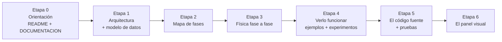

# Guía de estudio de `qiskit-qkd`

> **Qué es este documento.** Un *mapa de lectura* para entender el proyecto completo
> paso a paso, en el orden correcto. No repite el contenido técnico: te dice **qué leer,
> en qué orden y con qué objetivo**, y qué deberías saber responder al terminar cada
> etapa. El contenido en profundidad vive en [`DOCUMENTACION.md`](../DOCUMENTACION.md) y en
> [`docs/`](./).
>
> **Para quién es.** Para cualquiera que llegue por primera vez (incluido el tribunal del
> TFG, un colaborador, o tú mismo dentro de seis meses) y quiera pasar de "no sé por dónde
> empezar" a "entiendo cómo encaja todo".

**Leyenda de idioma:** 🇪🇸 documento en español · 🇬🇧 documento en inglés.
La visión global y el panel están en español; la documentación técnica de `docs/` está en
inglés. Lo indico en cada paso para que no te pille por sorpresa.

---

## Cómo usar esta guía

Hay tres formas de recorrerla según tu tiempo y tu objetivo:

- **Vía exprés (≈20 min):** pasos **1 y 2**. Sales sabiendo *qué* es el proyecto y *por qué*
  está diseñado así.
- **Vía conceptual (≈2-3 h):** etapas **0 a 3**. Entiendes la arquitectura, el modelo de
  datos y la física de cada fase, sin tocar código.
- **Vía completa:** las **7 etapas** de abajo, de principio a fin. Terminas pudiendo
  modificar el código y defender cualquier decisión de diseño.

Si solo te interesa un ángulo concreto (física, código, defensa del TFG o panel), salta a
[Recorridos según tu objetivo](#recorridos-según-tu-objetivo).

> **Consejo:** antes de empezar las etapas, lee los
> [7 conceptos transversales](#7-conceptos-transversales). Son las ideas que se repiten en
> *todos* los documentos. Una vez las tienes, el resto encaja solo.

---

## El proyecto en una página

`qiskit-qkd` es una **librería de Python que simula protocolos de Distribución de Claves
Cuánticas (QKD)** —BB84 y E91— con una frontera física explícita. Su decisión central es una
**frontera**: Qiskit se ocupa solo del estado cuántico (circuitos, puertas, medidas),
mientras que todo lo demás —pérdidas de fotones, detectores, ruido óptico, timing,
espionaje y post-proceso clásico— se simula en una **capa de eventos** clásica.

Se construyó **por fases incrementales** (0 → 9): cada fase añade un trozo de realismo
físico y declara explícitamente qué deja fuera. Encima de la librería hay un **panel visual**
(API FastAPI + web React) para diseñar escenarios, caracterizar enlaces y generar curvas.



---

## 7 conceptos transversales

Estas siete ideas aparecen una y otra vez. Tenerlas claras de antemano hace que toda la
documentación se lea sola.

1. **"Qiskit-first, no Qiskit-only".** Es la decisión de diseño raíz. Qiskit hace lo
   cuántico; la librería hace lo fotónico/clásico. Casi cada documento justifica de qué lado
   de esa frontera cae cada fenómeno.
2. **Capa de eventos vs capa cuántica.** Un fotón perdido en la fibra **no llega al
   detector** (no hay click); *no* se modela como un qubit que decae a `|0⟩`. Por eso las
   pérdidas, dark counts y timing viven fuera de Qiskit.
3. **Honestidad del modelo.** El post-proceso (sifting, reconciliación) usa **solo lo que
   Alice y Bob podrían anunciar públicamente**. El simulador "sabe" más (qué click fue ruido,
   qué hizo Eve), pero esa información es solo para diagnóstico/trazabilidad. La excepción
   declarada es `qber_sample_fraction=0`: usa la clave cribada completa como diagnóstico
   interno, no como una estimación disponible en el protocolo público.
4. **Desarrollo por fases incrementales.** El orden de las fases (0, 1, 2, 3, 3.5, 3.6, 4,
   4.1, 5, 6, 6.1, 6.2, 7, 8, 9) **es** el orden lógico de lectura. Cada fase añade una capa
   de realismo y dice qué deja fuera a propósito.
5. **Reproducibilidad condicionada.** Un `Scenario` normalizado produce el mismo *digest*.
   Repetir el resultado exige además el mismo modelo efectivo, versiones, backend/primitive
   y semillas de ejecución; la semilla central por sí sola no es una garantía transversal.
6. **Filas planas "listas para graficar" (plot-ready rows).** El análisis produce JSON/CSV
   plano; la visualización y el panel solo *consumen* esas filas. Es el puente entre física,
   gráficas y panel, y mantiene la simulación independiente de matplotlib o la web.
7. **Diagnóstico, no prueba de seguridad.** Las tasas de clave y la estimación decoy son
   **asintóticas y pedagógicas**. CHSH es un estadístico observado sobre coincidencias,
   sin test de significación ni cierre de *loopholes*. Ninguno constituye una prueba
   finite-key, componible o device-independent. Reconocer este límite es parte de entender
   el proyecto.

---

## Itinerario de lectura, paso a paso

Siete etapas (0 a 6), de lo abstracto a lo concreto. Cada documento está numerado de forma global
(1 → 22) para que el orden sea inequívoco. Para cada uno: **qué es**, **por qué se lee
ahora** y el **hito** (lo que deberías poder responder al terminarlo).

### Etapa 0 — Orientación (la panorámica)

> **Idea:** antes de cualquier detalle, qué es el proyecto y cuál es su filosofía.

**1. [`README.md`](../README.md)** 🇬🇧
- *Qué es:* el resumen ejecutivo. Qué incluye el paquete, cómo instalarlo, y la lista de
  demos ejecutables. El primer párrafo resume las fases 0–9 en orden.
- *Por qué ahora:* es la puerta de entrada y te da el vocabulario mínimo.
- *Hito:* sabes qué protocolos cubre (BB84, E91), cómo instalar (`pip install -e .`) y que
  el desarrollo va por fases.

**2. [`DOCUMENTACION.md`](../DOCUMENTACION.md)** 🇪🇸 — *el documento ancla*
- *Qué es:* la visión global completa en español. Cinco secciones: (1) filosofía de diseño,
  (2) lista de fases, (3) arquitectura y flujo de datos con diagrama, (4) modelos físicos y
  fórmulas, (5) estructura del código y (6) pruebas.
- *Por qué ahora:* es el mejor "todo en uno". Léelo entero aunque algunas fórmulas se te
  escapen; volverás a ellas en la Etapa 3.
- *Hito:* puedes explicar la frontera Qiskit/eventos y seguir el flujo de un pulso desde
  `Scenario` hasta `SimulationResult` con el diagrama de la sección 3.

### Etapa 1 — La idea central: la frontera y los datos

> **Idea:** dos documentos que fijan *cómo está partido* el sistema y *con qué objetos*
> trabaja. Todo lo demás cuelga de aquí.

**3. [`docs/architecture.md`](architecture.md)** 🇬🇧
- *Qué es:* la frontera Qiskit-first explicada capa por capa (Qiskit / capa de eventos /
  análisis-visualización), seguida de una nota de arquitectura por cada fase y el **flujo de
  datos** numerado de principio a fin.
- *Por qué ahora:* convierte el concepto transversal nº1 en algo operativo: qué módulo hace
  qué.
- *Hito:* sabes decir, para cualquier fenómeno (pérdida, jitter, despolarización, Eve), de
  qué lado de la frontera vive y por qué.

**4. [`docs/domain_model.md`](domain_model.md)** 🇬🇧
- *Qué es:* los objetos de datos. `Scenario` y sus configs (`SourceConfig`, `ChannelConfig`,
  `DetectorConfig`, `TimingConfig`, `PostProcessingConfig`, `EveConfig`, `E91Config`,
  `DynamicConfig`), y las salidas (`Event`, `Metrics`, `SimulationResult`).
- *Por qué ahora:* son el vocabulario que usan *todas* las fases. Sin esto, los documentos de
  fase parecen sopa de siglas.
- *Hito:* sabes qué contiene un `Scenario`, qué traza un `Event` y qué agrega `Metrics`.

**5. [`docs/parameters.md`](parameters.md)** 🇬🇧 — *referencia, hojear ahora*
- *Qué es:* el diccionario completo de parámetros, con unidades en el nombre
  (`distance_km`, `gate_width_s`…) y las fórmulas asociadas, sección por sección
  (Scenario, E91, Dynamic, Eve, Source, Channel, Detector, Timing, Post-Processing).
- *Por qué ahora:* **no lo leas linealmente**. Hojéalo para saber que existe y vuelve a él
  como consulta cuando una fórmula aparezca en la Etapa 3.
- *Hito:* sabes dónde buscar el significado y las unidades de cualquier parámetro.

### Etapa 2 — El mapa de fases

> **Idea:** una vez tienes arquitectura y datos, necesitas la hoja de ruta que ordena todo
> el realismo físico.

**6. [`docs/development.md`](development.md)** 🇬🇧
- *Qué es:* el alcance fase por fase (0 → 9): qué añade cada una y, crucialmente, **qué deja
  fuera a propósito**. Incluye entorno, comandos, "reading baseline" (Qiskit, Aer, QKD) y
  convenciones de código.
- *Por qué ahora:* es el índice maestro de la Etapa 3. Cada subsección "Phase X Scope" es el
  resumen del documento de fase que leerás a continuación.
- *Hito:* puedes recitar qué problema resuelve cada fase y por qué se añadió *después* de la
  anterior.

### Etapa 3 — La física, fase a fase (el corazón)

> **Idea:** ahora sí, en profundidad y en el orden en que se construyó. Cada documento asume
> lo anterior. Apóyate en `parameters.md` (paso 5) para las fórmulas.

**7. [`docs/phase_3_5_validation.md`](phase_3_5_validation.md)** 🇬🇧
- *Qué es:* el informe que valida el **núcleo físico** (fibra + timing + detector) contra
  tendencias QKD conocidas, con tablas de barridos (distancia, jitter, offset de reloj,
  dark counts, dead time, afterpulsing).
- *Por qué ahora:* consolida las fases 3 y 3.5 mostrando que el modelo base "se comporta
  bien" antes de añadir capas. Es el mejor sitio para *ver* la física, no solo leerla.
- *Hito:* entiendes por qué el QBER tiende a 0.5 a larga distancia y cómo el gate temporal
  filtra el jitter.

**8. [`docs/qiskit_integration.md`](qiskit_integration.md)** 🇬🇧 — *Fase 4*
- *Qué es:* la frontera Qiskit/Aer hecha tabla. Qué ruido va en `NoiseModel`
  (despolarización, dephasing, readout) y qué sigue en la capa de eventos. Transpilación y
  *provenance*.
- *Por qué ahora:* es la primera capa de ruido *cuántico* sobre el núcleo ya validado.
- *Hito:* distingues ruido cuántico de estado (Aer) de ruido fotónico/detector (eventos).

**9. [`docs/dynamic_parameters.md`](dynamic_parameters.md)** 🇬🇧 — *Fase 4.1*
- *Qué es:* perfiles temporales (constante, lineal, exponencial) que varían parámetros del
  enlace en el tiempo, y la caracterización de canal en filas planas.
- *Por qué ahora:* introduce el concepto transversal nº6 (filas listas para graficar) que
  luego usan visualización y panel.
- *Hito:* sabes cómo se resuelve un `Scenario` "efectivo" en un instante `t` sin mutar el
  original.

**10. [`docs/eavesdropping.md`](eavesdropping.md)** 🇬🇧 — *Fase 5 (+ PNS de 6.2)*
- *Qué es:* los modelos de espía: `InterceptResendEve` y, más adelante,
  `PhotonNumberSplittingEve`. Por qué Eve se mantiene separada del ruido accidental.
- *Por qué ahora:* primer adversario explícito; conecta con la "honestidad del modelo"
  (concepto nº3).
- *Hito:* sabes por qué intercept-resend produce ~25% de QBER y por qué PNS no añade QBER.

**11. [`docs/decoy_states.md`](decoy_states.md)** 🇬🇧 — *Fase 6 (+ 6.2)*
- *Qué es:* fuentes coherentes atenuadas (WCS) con estados señuelo, muestreo de Poisson,
  estadística por intensidad y el estimador asintótico vacuum+weak (`Y1`, `Q1`, `e1`).
- *Por qué ahora:* generaliza la fuente ideal de un fotón hacia algo realista; usa la
  estadística por intensidad para construir cotas asintóticas diagnósticas.
- *Hito:* entiendes para qué sirven las intensidades señal/decoy/vacío y por qué el
  estimador es asintótico (concepto nº7).

**12. [`docs/e91.md`](e91.md)** 🇬🇧 — *Fase 7*
- *Qué es:* el protocolo E91 basado en pares de Bell, las correlaciones y el diagnóstico
  CHSH (`S`). Implementado como protocolo *separado*, no como variante de BB84.
- *Por qué ahora:* demuestra que la misma frontera Qiskit/eventos soporta protocolos de
  entrelazamiento.
- *Hito:* sabes qué mide `S`, por qué el ideal tiende a 2√2 y dónde se aplican las fronteras
  (p. ej. por qué la PDL clásica de BB84 no aplica a E91).

**13. [`docs/optical_channels.md`](optical_channels.md)** 🇬🇧 — *Fase 8*
- *Qué es:* canales no-fibra: espacio profundo (`space`), espacio libre/satélite
  (`free_space`) y subacuático (`underwater`), con pérdidas geométricas, extinción,
  scintillation, jitter de apuntamiento y ensanchamiento por scattering.
- *Por qué ahora:* amplía el "medio" físico manteniendo el ruido cuántico explícito en
  Qiskit/Aer.
- *Hito:* sabes qué distingue cada medio y por qué siguen siendo modelos de "presupuesto de
  enlace", no de óptica completa.

**14. [`docs/visualization.md`](visualization.md)** 🇬🇧 — *Fase 9*
- *Qué es:* la capa de analítica visual opcional (matplotlib) que consume las filas planas y
  devuelve figuras reproducibles. Importa matplotlib solo si se usa.
- *Por qué ahora:* cierra el ciclo simulación → análisis → figura, justo antes del panel.
- *Hito:* entiendes por qué graficar es un *consumidor* de datos y no parte del núcleo de
  simulación.

### Etapa 4 — Verlo funcionar

> **Idea:** baja de la teoría al teclado. Ejecuta y lee código pequeño que materializa cada
> concepto.

**15. [`examples/README.md`](../examples/README.md)** 🇬🇧 — *y ejecutar los scripts*
- *Qué es:* nueve demos ejecutables, una por concepto, en orden creciente de complejidad:
  [`bb84_ideal.py`](../examples/bb84_ideal.py) → [`bb84_fiber_sweep.py`](../examples/bb84_fiber_sweep.py)
  → [`bb84_aer_noisy.py`](../examples/bb84_aer_noisy.py) →
  [`bb84_physical_noise.py`](../examples/bb84_physical_noise.py) →
  [`bb84_dynamic_channel.py`](../examples/bb84_dynamic_channel.py) →
  [`bb84_eve_intercept_resend.py`](../examples/bb84_eve_intercept_resend.py) →
  [`bb84_decoy.py`](../examples/bb84_decoy.py) → [`e91_chsh.py`](../examples/e91_chsh.py) →
  [`bb84_visualization.py`](../examples/bb84_visualization.py).
- *Por qué ahora:* el orden de los ejemplos espeja el orden de las fases que acabas de leer.
- *Hito:* has ejecutado al menos `bb84_ideal.py` y `bb84_fiber_sweep.py` y reconoces las
  métricas en su salida.

**16. [`experiments/`](../experiments)** 🇪🇸
- *Qué es:* dos suites pedagógicas —
  [`experimentos_inesperados.py`](../experiments/experimentos_inesperados.py) y
  [`experimentos_dinamicos.py`](../experiments/experimentos_dinamicos.py)— con fenómenos "no
  intuitivos pero explicables" (más eficiencia no siempre ayuda, el vacío decoy es útil,
  la trampa de la amplificación de privacidad…).
- *Por qué ahora:* afianzan la intuición física una vez entiendes los parámetros. Excelente
  material para la memoria del TFG.
- *Hito:* puedes explicar al menos un resultado "sorprendente" en términos del modelo.

### Etapa 5 — El código fuente

> **Idea:** lee el código en el orden del flujo de datos, no alfabético. La sección 5 de
> [`DOCUMENTACION.md`](../DOCUMENTACION.md) es tu índice de módulos.

**17. [`src/qiskit_qkd/`](../src/qiskit_qkd)** — recorrido por flujo de datos
- *Orden sugerido siguiendo el viaje de un pulso:*
  1. Configuración y validación → [`config/schema.py`](../src/qiskit_qkd/config/schema.py)
  2. Fuente → [`sources/single_photon.py`](../src/qiskit_qkd/sources/single_photon.py)
  3. Canal → [`channels/`](../src/qiskit_qkd/channels) (fibra, ideal, espacio, *impairments*)
  4. Orquestación física por pulso → [`channel_core.py`](../src/qiskit_qkd/channel_core.py) y
     [`timing.py`](../src/qiskit_qkd/timing.py)
  5. Adversario → [`eavesdroppers/bb84.py`](../src/qiskit_qkd/eavesdroppers/bb84.py)
  6. Cuántico → [`qiskit_integration/circuits.py`](../src/qiskit_qkd/qiskit_integration/circuits.py)
     y [`backends/qiskit_sampler.py`](../src/qiskit_qkd/backends/qiskit_sampler.py)
  7. Detector → [`detectors/threshold.py`](../src/qiskit_qkd/detectors/threshold.py)
  8. Post-proceso → [`postprocessing/`](../src/qiskit_qkd/postprocessing) (sifting, classical,
     key_rate, decoy, e91)
  9. Orquestación de protocolo → [`protocols/bb84.py`](../src/qiskit_qkd/protocols/bb84.py) y
     [`protocols/e91.py`](../src/qiskit_qkd/protocols/e91.py)
  10. Resultados y análisis → [`results/`](../src/qiskit_qkd/results),
      [`analysis/`](../src/qiskit_qkd/analysis), [`visualization/`](../src/qiskit_qkd/visualization)
- *Por qué ahora:* con las fases claras, el código se lee como la materialización del flujo
  del paso 3 de [`docs/architecture.md`](architecture.md).
- *Hito:* puedes seguir una llamada `BB84Protocol.run()` por los módulos en orden.

**18. [`tests/`](../tests)** 🇬🇧
- *Qué es:* la suite que valida cada fase (un fichero por área: ruido Aer, BB84 ideal,
  canales, post-proceso, decoy, E91, espías, impairments, detectores, timing…). Resumen en
  la sección 6 de [`DOCUMENTACION.md`](../DOCUMENTACION.md).
- *Por qué ahora:* los tests son la especificación ejecutable: muestran el uso esperado y
  los invariantes de cada módulo.
- *Hito:* sabes ejecutar `python -m pytest` y localizar el test que cubre una fase concreta.

### Etapa 6 — El panel visual (subproyecto)

> **Idea:** una aplicación local encima de la librería. Léelo al final: asume que ya
> entiendes el `Scenario` y la caracterización.

**19. [`panel/README.md`](../panel/README.md)** 🇪🇸
- *Qué es:* cómo arrancar el panel (API FastAPI + web Vite/React) en modo desarrollo y en
  modo demo, y la verificación rápida.
- *Por qué ahora:* te deja *ver* el panel funcionando antes de entrar en su diseño.
- *Hito:* tienes el panel corriendo en `http://127.0.0.1:8000`.

**20. [`docs/superpowers/specs/2026-06-14-qkd-medium-first-dashboard-design.md`](superpowers/specs/2026-06-14-qkd-medium-first-dashboard-design.md)** 🇬🇧
- *Qué es:* la especificación de la experiencia "medium-first": empezar por el medio físico
  y mostrar solo los controles que tienen sentido.
- *Por qué ahora:* explica el *porqué* de la UI antes de ver el *cómo*.
- *Hito:* entiendes la idea de galería de medios → cockpit → inspector avanzado.

**21. Planes de implementación** 🇪🇸 — [`docs/superpowers/plans/`](superpowers/plans)
- *Qué es:* la hoja de ruta del panel.
  [Plan del panel visual](superpowers/plans/2026-06-12-qkd-visual-panel.md) (arquitectura
  de 3 capas: librería → API → web),
  [implementación medium-first](superpowers/plans/2026-06-14-qkd-medium-first-dashboard-implementation.md)
  y la [transición de `channel_core`](superpowers/plans/2026-05-19-channel-core-transition.md).
- *Por qué ahora:* conecta el diseño con tareas concretas y con cómo la API reutiliza la
  librería como única fuente de verdad.
- *Hito:* sabes cómo la web habla con la API y la API con `src/qiskit_qkd`.

**22. [`panel/web/README.md`](../panel/web/README.md)** 🇪🇸
- *Qué es:* el frontend (Vite + React 18 + TypeScript): comandos de dev, test, lint y build.
- *Por qué ahora:* el último nivel de detalle, solo si vas a tocar la interfaz.
- *Hito:* sabes levantar el frontend y dónde están las *features* en `panel/web/src/features`.

---

## Recorridos según tu objetivo

Si no vas a hacer la vía completa, estos son los subconjuntos mínimos según para qué vienes:

| Tu objetivo | Lee en este orden | Puedes saltarte |
| --- | --- | --- |
| **Entender la física QKD** | 2 → 3 → 5 (consulta) → 7 → 8 → 10 → 11 → 12 → 13 | Código fuente y panel |
| **Modificar / extender el código** | 3 → 4 → 6 → 17 → 18 → la fase concreta de la Etapa 3 | Experimentos y panel |
| **Visión global para defender el TFG** | 1 → 2 → 6 → 7 → 16 → 19 | Detalles de paquetes individuales |
| **Trabajar en el panel** | 2 → 4 → 9 → 14 → 19 → 20 → 21 → 22 | Fases físicas en profundidad (5, 7, 8) |

---

## Checklist de comprensión

Si puedes responder esto sin volver a los documentos, has entendido el proyecto:

- [ ] ¿Por qué la pérdida en fibra **no** se modela con `amplitude_damping`?
- [ ] ¿Qué decide Qiskit y qué decide la capa de eventos? Da tres ejemplos de cada lado.
- [ ] ¿Qué es un `Scenario` y qué lo hace reproducible?
- [ ] ¿Qué añadió cada fase y qué dejó explícitamente fuera?
- [ ] ¿Por qué el QBER tiende a 0.5 a larga distancia?
- [ ] ¿Por qué un ataque intercept-resend total produce ~25% de QBER, pero PNS no añade QBER?
- [ ] ¿Por qué la tasa de clave es asintótica/pedagógica y el CHSH es solo un cruce de
      umbral observado sin significación ni cierre de *loopholes*?
- [ ] ¿Cómo fluye un pulso desde `Scenario` hasta `SimulationResult`? (sigue el diagrama de
      [`DOCUMENTACION.md`](../DOCUMENTACION.md) §3)
- [ ] ¿Cómo se conectan librería → API → web en el panel, y por qué la API es una "capa fina"?

---

## Resumen del orden canónico

```
0. Orientación        1. README.md  ·  2. DOCUMENTACION.md
1. Frontera + datos   3. architecture  ·  4. domain_model  ·  5. parameters (referencia)
2. Mapa de fases      6. development
3. Física por fase    7. phase_3_5_validation  ·  8. qiskit_integration  ·  9. dynamic_parameters
                      10. eavesdropping  ·  11. decoy_states  ·  12. e91  ·  13. optical_channels  ·  14. visualization
4. Verlo funcionar    15. examples/  ·  16. experiments/
5. Código fuente      17. src/qiskit_qkd/ (por flujo de datos)  ·  18. tests/
6. Panel visual       19. panel/README  ·  20. dashboard-design (spec)  ·  21. plans/  ·  22. panel/web/README
```
